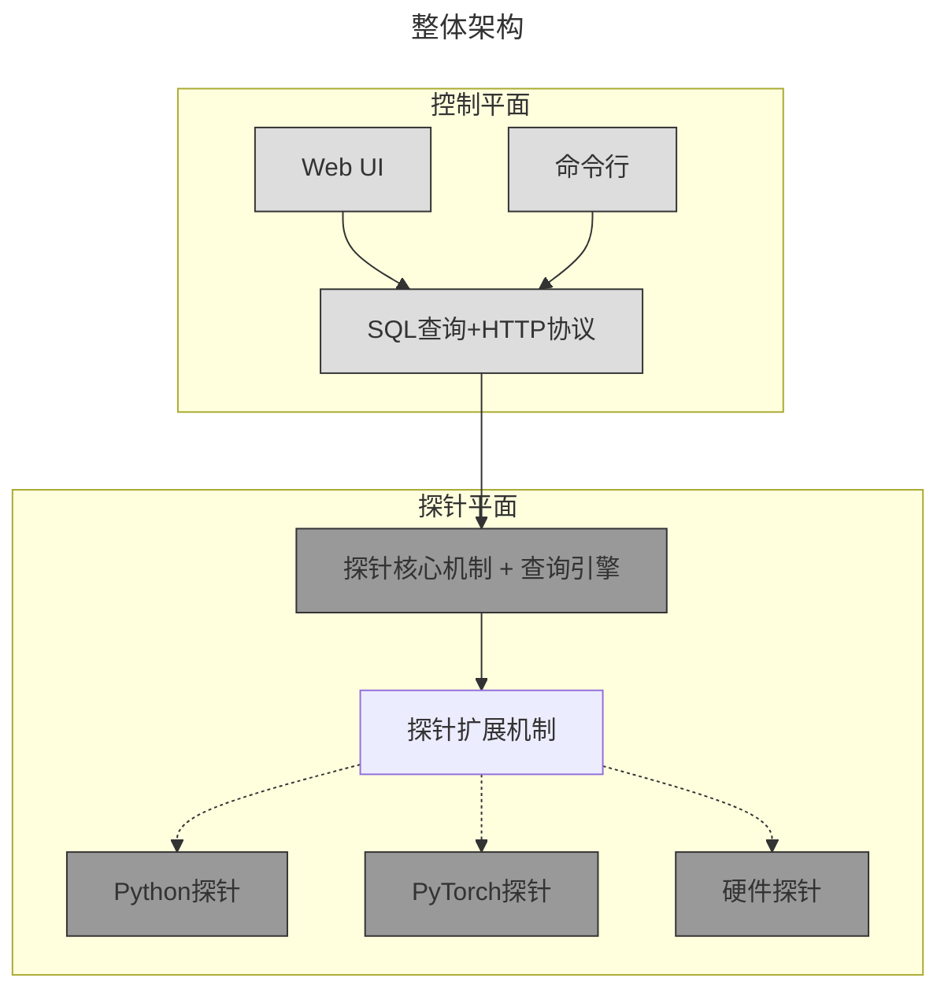

# 大规模分布式异构训练面临的挑战

当前顶级的LLM训练已经进入万卡时代，即便最为节约算力成本的DeepSeek也采用2000张H100，等效FP16算力达5000+ A100。然而，性能诊断体系严重滞后于算力规模扩张，主要体现在以下三个方面：

* **GPU故障为常态**：在Meta的LLaMA3训练中[^1]，16, 000张H100在54天内共出现466次故障，其中58.2%源自GPU硬件故障。这意味着每天都要面临8次GPU故障，严重影响训练的连续性和稳定性; 

* **性能不及预期也是故障**：由于使用大规模的集合通信语义(比如All Reduce)进行同步训练，慢节点会引发整个系统效率下降。在字节的MegaScale的一项实测中[^2]，移除慢节可带来0.7%的MFU提升。LLaMA-3训练中，也提到这种慢节点问题定位极为困难；

* **硬件、系统与模型优化割裂**：芯片层面的诊断数据未能被系统与模型有效利用。目前，系统与模型仅关注算力利用率MFU，而内存带宽利用率MBU、C2C互联带宽与网络带宽利用率缺乏关注，导致硬件、系统与模型之间的优化无法形成合力; 

由上述挑战可知，现有工具在应对大规模分布式环境时存在固有局限，难以同时满足实时性能监控和精细化数据采集的需求。

## 现有工具与方法难以应付这些挑战

现有诊断工具多聚焦于单一维度，难以在硬件故障、系统通信与模型表现等层面实现综合分析，且缺乏对分布式环境的可视化与实时监测能力。这大大增加了研发团队的诊断成本和时间。具体缺陷包括：

* **事前工具限制** 现有工具需要在问题发生之前预先部署与插桩，否则无法捕获事中或事后发生的故障信息。大量故障和性能问题通常是在训练过程中或之后才暴露，导致无法有效进行回溯分析; 
* **高性能开销** 这些工具在捕获和诊断过程中消耗大量GPU资源及通信带宽，对生产任务性能影响巨大，难以在真实生产环境中常驻部署; 
* **专注单机，缺乏分布式能力** 目前多数诊断工具仅关注单节点或单GPU数据，缺少针对跨节点通信、负载均衡等分布式训练场景的综合分析能力，难以定位整个系统的性能瓶颈; 

> 为了突破上述局限，我们需要一款既具备低侵入性和实时监控能力，又能在分布式场景下实现全链路数据采集与关联分析的诊断工具。

## 理想的诊断工具应该具备哪些特性

* **全天候**  
  能够在任何时刻动态启用，无需预先部署或插桩，在生产任务中以极低性能开销持续运行，实现实时监控与故障追溯，帮助工程团队及时响应系统异常和硬件故障；

* **全场景**  
  不仅支持单机诊断，还能无缝覆盖分布式训练环境，无论集群规模如何，都能确保数据采集与故障分析的一致性，满足从小规模研发到大规模生产的需求；

* **全链路**  
  实现从硬件层面的诊断数据、芯片互联状态，到框架、系统和模型各层数据的全面采集，构建完整的闭环监控系统，从而为硬件芯片公司提供关键的反馈数据，以便优化产品设计和性能。

# 一种分布式探针系统——Probing

Probing 针对上述问题提供以下技术方案：

+ **探针机制**  
  采用 ptrace 或基于 LD_LIBRARY_PATH 的动态库注入方式，将探针注入目标进程，从而获得与目标进程相同的内存地址空间与权限。这种方案允许在进程内部直接观测和调试，超越传统进程外工具的监控能力。值得指出的是，在没有发出监控指令的情况下，探针处于完全静默状态，不会引入额外的性能开销。

+ **Query 引擎**  
  借助标准 SQL 引擎实现数据管理与分析。针对数值序列和字符串序列，Query 引擎分别采用不同的压缩编码算法，利用数据的局部性进行压缩。数据压缩比视具体数据而定，可达到5倍到上百倍的压缩效果，从而显著降低存储开销并保障时序数据精度。

+ **分布式数据处理**  
  依托 Query 引擎的分布式处理能力，能够自动将数据计算任务拆分为各个节点内部的局部汇总计算与跨节点的数据聚合分析，实现大规模分布式环境下统一的高效监控与诊断。

针对分布式与异构计算两个关键问题，Probing进行特殊优化：

- **分布式**
  - 分布式训练状态感知：实时监控各节点计算和通信状态，支持自动发现性能异常节点
  - 集合通信性能优化：针对常见分布式训练模式(DP/TP/PP)提供专门的性能分析工具
  - 负载均衡分析：跟踪记录各节点负载分布情况，及时发现训练过程中的性能瓶颈


- **异构计算**
  - 全链路数据采集：统一采集从硬件到框架各层面的性能指标，支持关联分析
  - 硬件性能优化：通过分析训练负载特征，为硬件性能调优提供数据支持

## 整体架构



Probing在整体设计采用简单可靠的两层设计：
1. 探针平面，实现为一个纯静态链接的so，会被注入到训练进程内，提供：
   1. 核心机制：实现数据采集与代码注入；
   2. 查询引擎：提供数据存储与分析能力；
   3. 扩展机制：提供基于Python与Rust扩展探针能力的机制，同时提供Python、Torch和硬件等探针功能；
2. 控制平面，提供用户交互界面，包括:
   1. Web界面：可视化操作与数据展示
   2. 命令行工具：灵活的探针控制
   3. 统一API：标准化的接口规范

在分布式场景中，每个节点的每个进程都拥有独立探针，探针之间互为平等，无Master节点，避免单点故障。控制平面可单独管理任意进程，也可通过该进程探针再控制其他节点。

```mermaid
---
title: 分布式部署视图
---
graph TB
    subgraph "控制平面"
        UI[Web UI]
        CLI[命令行]
        API[统一API]
        UI & CLI --> API
    end
    
    subgraph "Node 1"
        P1[训练进程]
        PR1[探针]
        P1 -.- PR1
    end
    
    subgraph "Node 2"
        P2[训练进程]
        PR2[探针]
        P2 -.- PR2
    end
    
    subgraph "Node 3"
        P3[训练进程]
        PR3[探针]
        P3 -.- PR3
    end

    PR1 <--自动发现--> PR2
    PR2 <--自动发现--> PR3
    PR3 <--自动发现--> PR1
    
    API --控制/查询--> PR1


    style UI fill:#ddd,stroke:#333
    style CLI fill:#ddd,stroke:#333
    style API fill:#ddd,stroke:#333
    style P1 fill:#f9f,stroke:#333
    style P2 fill:#f9f,stroke:#333
    style P3 fill:#f9f,stroke:#333
    style PR1 fill:#bfb,stroke:#333
    style PR2 fill:#bfb,stroke:#333
    style PR3 fill:#bfb,stroke:#333
  ```

## 查询引擎

引入查询引擎可以极大简化探针内部的数据存储与处理模块的设计，查询引擎内部对于查询的处理过程如下图所示：

```mermaid
graph LR
  sql["Query Language"]
  -->  lp["Logical Plan"]
  --> pp["Physical Plan"]
  --> ds["Data Sources"]
```

其中：
1. Query Language是用户书写的查询语言，一般是SQL或者DataFrame API；
2. Logical Plan描述查询的高层结构与所需的逻辑操作，并不关心底层执行细节；
3. Physical Plan: 基于逻辑计划生成的具体执行方案，包含数据分布、算子实现等底层执行细节；
4. Data Sources： 是数据源，任何Query都将被转换为数据源上的操作；

整个处理流程复用了开源查询引擎DataFusion提供的标准实现。Probing主要将探针能够获取的各种数据作为DataFusion的数据源扩展。数据源按照三级来组织：
```
Catalog (命名空间)
   |
   +-- Schema1 (逻辑分组)
   |     |
   |     +-- Table1
   |     +-- Table2
   |
   +-- Schema2
         |
         +-- Table3
```

## 扩展机制

Probing支持两类数据源插件，分别用于静态和动态数据场景：

##### TablePlugin
静态表格数据源插件，用于提供结构固定的单一数据表。适用于:
- 硬件性能指标(CPU/GPU利用率、温度等)
- 进程状态监控(内存占用、线程数等)
- 固定格式的性能计数器数据

##### SchemaPlugin 
动态表格数据源插件，支持按需创建多个数据表。适用于:
- 文件系统监控(每个文件映射为表)
- Python模块跟踪(每个模块映射为表) 
- 动态生成的性能分析数据

除了上述两种扩展机制外，Probing还提供使用Python扩展的查询引擎的机制：

##### 即时查询

任何Python包的函数均可视作查询引擎的扩展，只需要在SQL语句中按如下方式书写：
```SQL
-- 直接执行Python表达式
SELECT *
FROM python.`<Python语句>`
```
比如
```SQL
SELECT *
FROM python.`time.time()`
```
将会在节点上调用`time.time()`这个语句，并将结果作为表格返回；

##### 表格注册

用户也可以在代码中主动向Probing写入数据
```python
import probing

# 创建并注册表格
tbl = probing.ExternalTable("test", ["col1", "col2"])

# 写入数据
tbl.append([1, 0.1])
tbl.append([2, 0.2])
tbl.append([3, 0.3])
```
Python写入的数据也会自动被查询引擎进行压缩和优化。
```SQL
-- 查询已注册表格
SELECT *
FROM python.test
```

## 与其他工具的比较

| 特性维度           | NVIDIA DCGM  | Nsight Systems       | Torch Profiler       | **Probing**                    |
|-----------------|--------------|----------------------|----------------------|--------------------------------|
| **侵入性**         | 无（驱动级）   | 低(需事先注入)       | 高(修改代码)         | **极低(动态注入)**             |
| **性能开销**       | 无           | 动态（随采样频率变化） | 高                   | **动态(随采样频率变化)**       |
| **分布式关联分析** | ❌单节点      | ❌单进程              | ❌单进程              | **分布式查询**                 |
| **数据采集维度**   | 硬件指标     | 系统+应用层          | 框架层               | **全链路(硬件/框架/模型)**     |
| **动态启停能力**   | ❌常驻采集    | ❌需重启              | ❌代码修改            | **运行时注入🚀**               |
| **故障诊断能力**   | 硬件故障告警 | 性能瓶颈定位         | 算子性能分析         | **硬件→模型关联分析🔍**        |
| **慢节点检测**     | ❌            | ❌                    | ❌                    | **自动标记🏷️**                |
| **通信性能分析**   | 带宽利用率   | NCCL事件追踪         | 无                   | **通信+模型分析偶📊**          |
| **内存诊断**       | 显存占用量   | 显存访问模式         | 显存分配统计         | 待开发                         |
| **数据回溯能力**   | 滚动窗口存储 | 需导出文件（文件较大） | 需导出文件（文件较大） | **动态存储📦**                 |
| **硬件反馈价值**   | 基础健康监测 | 微架构优化           | 无                   | **结合workload指导芯片设计💎** |


# 参考文献

[^1]: [The Llama 3 Herd of Models](https://arxiv.org/pdf/2407.21783)

[^2]: [MegaScale: Scaling Large Language Model Training to More Than 10, 000 GPUs](https://arxiv.org/pdf/2402.15627)
